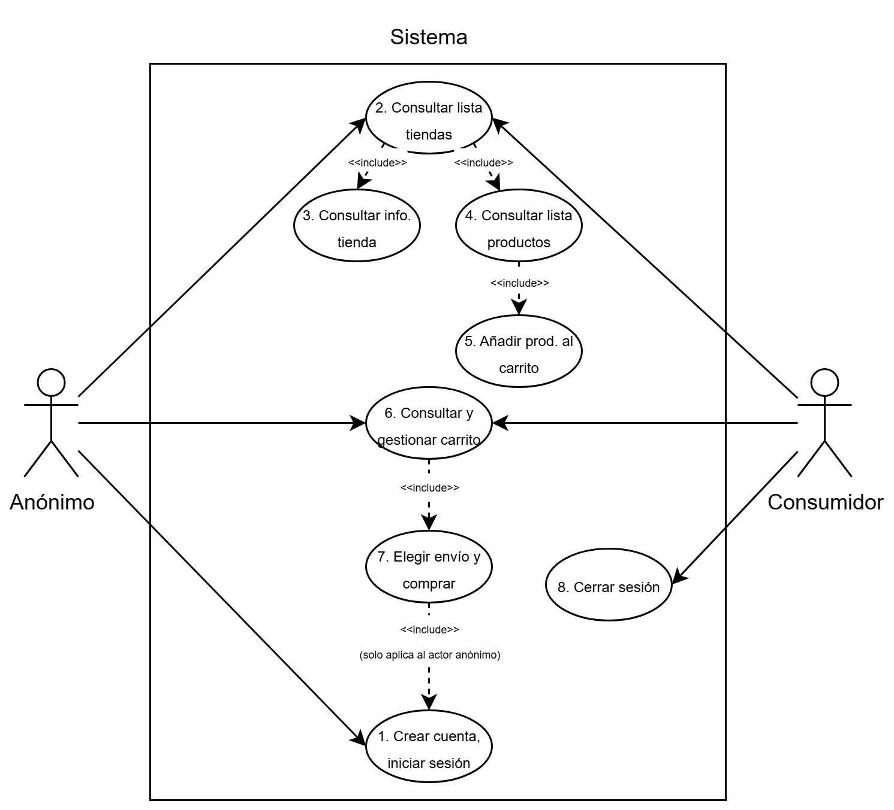
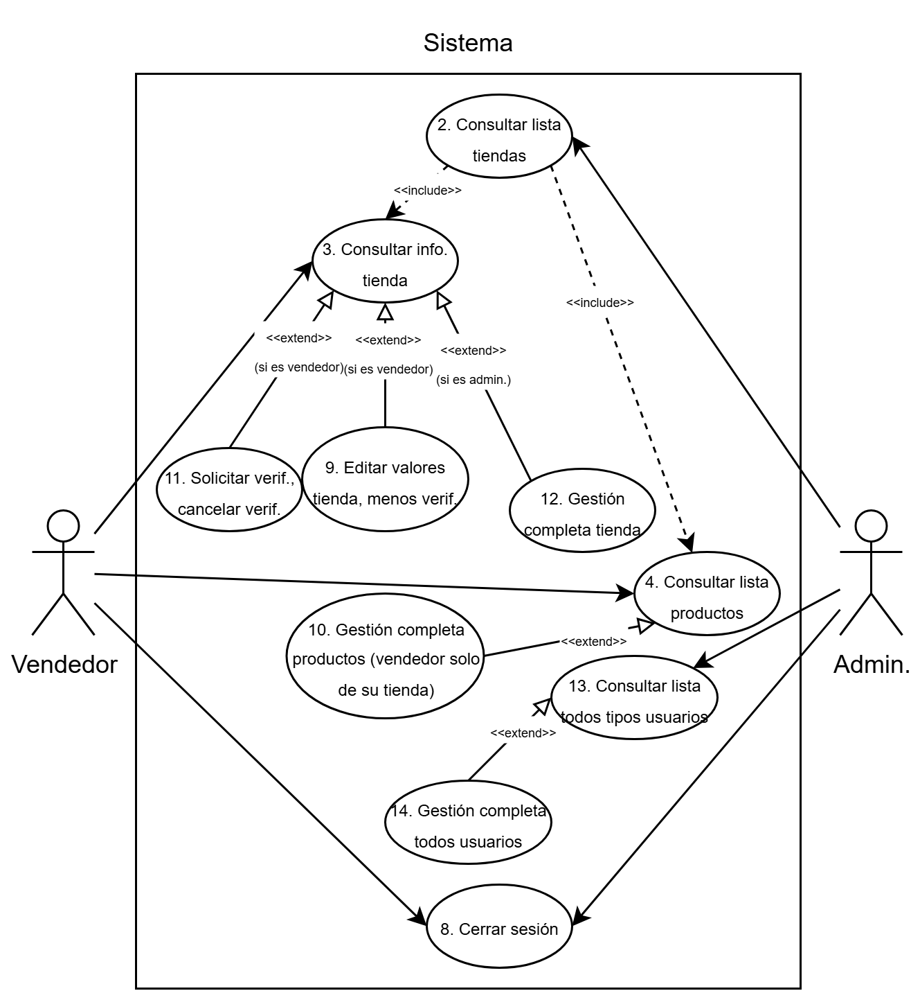
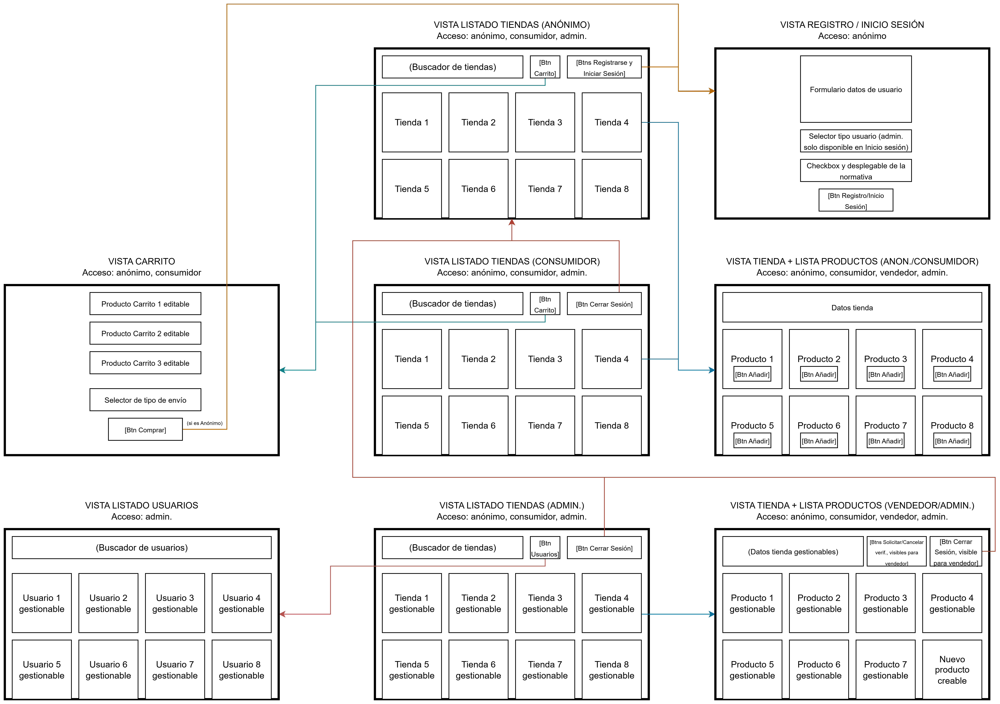

# Diseño

## Casos de uso

Aclaración: el caso de uso "Iniciar sesión" solo está disponible para el actor Anónimo, ya que una vez que inicia sesión se convierte en uno de los otros 3 actores. Estos 3 actores lo que pueden es "Cerrar sesión" para volver a ser el actor Anónimo.

## Diseño de interfaz de usuarios

## Diagrama de Bases de Datos

